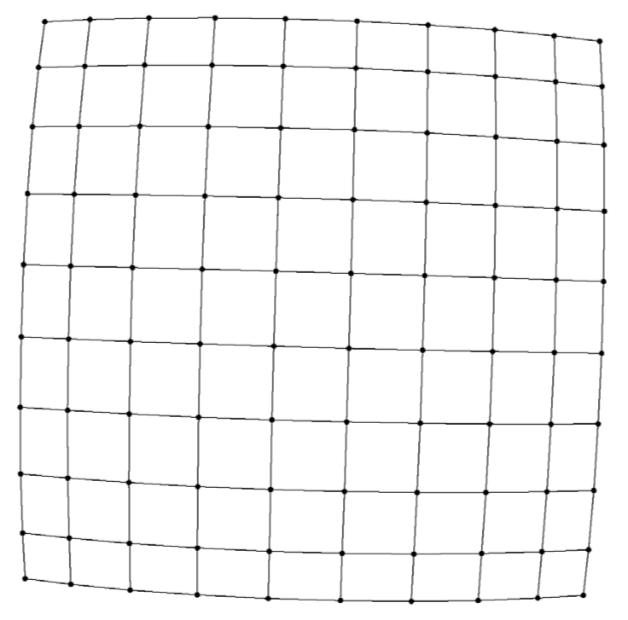

# Introduction

no strict criteria for aesthetics

- minimal edge crossing
- evenly distributed vertices
- depiction of graph symmetry 

spectral method

high-dimensional embedding method

drawback

- local minimum (improved by multilevel approach and adaptive cooling scheme)
- computational and memory complexity 

# models

minimize the system energy

## Force (spring-electrical models)

- springs between neighboring (**only**  between neighboring vertices)
- repulsive electrical forces (proportional to the inverse of the physical distance)

$\begin{aligned} f_{r}(i, j) &=-C K^{2} /\left\|x_{i}-x_{j}\right\| \\ f_{a}(i, j) &=\left\|x_{i}-x_{j}\right\|^{2} / K \end{aligned}​$

$K$: optimal distance, or natural spring length
$C$: relative strength of the repulsive and attractive force

$f_r=f_a \Rightarrow d(i,j)=K(C)^{1 / 3}$
Energy $_{\mathrm{se}}(x, K, C)=\sum_{i \in V} f^{2}(i, x, K, C)$

Theorem 1. Let $x^{*}=\left\{x_{i}^{*} | i \in V\right\}$ minimizes $\text { Energy }_{\text { se }}(x, K, C)$, then $\mathrm{sx}^{*}$minimizes Energy $_{\text { se }}\left(x, K^{\prime}, C^{\prime}\right)$, where $s=\left(K^{\prime} / K\right)\left(C^{\prime} / C\right)^{1 / 3}$.

we fix $C=0.2​$.

### peripheral effect

- reason: repulsive force decays as the distance increases 
- $f_{r}(i, j)=-C K^{1+p} /\left\|x_{i}-x_{j}\right\|^{p}​$, $p=2​$ works well

## spring model

spring attached between any two pairs of vertices

$f_{r}(i, j)=f_{a}(i, j)=\left\|x_{i}-x_{j}\right\|-d(i, j)​$

suffers from weak repulsive forces

Energy $_{s}(x)=\sum_{i \neq j, i, j \in V}\left(\left\|x_{i}-x_{j}\right\|-d(i, j)\right)^{2}​$

### adaptive cooling scheme

$t = 0.9$

- Increase `step` to  `step/t` if the energy reduced more than 5 times in a row

- only reduce the `step` length if energy increases 

reference

efficient, high-quality force-directed graph drawings

### quadtree and supernode

time complexity is reduced from $O(|V|^2)$ to $O(|V| \log (|V|))$

$f_{r}(i, S)=-|S| C K^{2} /\left\|x_{i}-x_{S}\right\|$ 

Barnes–Hut opening criterion: Each square is checked and
recursively opened until the inequality is satisfied
$$
\frac{d_{S}}{\left\|x_{i}-x_{S}\right\|} \leq \theta
$$
where $d_S$ is the width of the square that the cluster lies in, $\theta=1.2$

CPU time measurement: $\operatorname{counts}+\alpha$ ns
adaptively set `max_tree _level` 

## Graph coarsening

### EC: edge collapsing

the weight of a vertex/edge is the sum of weights of vertices/edges it replaces

- maximal  matching
- heavy-edge matching

coarsen the graph until $\frac{\left|V^{i+1}\right|}{\left|V^{i}\right|}>\rho(0.75)$ 

### MIVS: maximal independent vertex set 

result in a coarser graph with less than 50% vertices

$\gamma=\operatorname{diam}\left(G^{i}\right) / \operatorname{diam}\left(G^{i+1}\right)$，or $\gamma=\sqrt{7 / 4}$

$K^{i}=K^{i+1} / \gamma​$

only calculating the distance of two vertices *u* and *v* and their attractive/repulsive forces, if $d(u, v) \leq r(i+1)​$

cutoff radius for repulsive forces $R^{i}=r(i+1) K^{i}$

$r=4$

# reference

Yifan Hu, "*Efficient, High-Quality* Force-Directed Graph Drawing," The Mathematica Journal 

C. Walshaw, “A Multilevel Algorithm for Force-Directed Graph Drawing,” Journal of Graph Algorithms and Applications, 7(3), 2003 pp. 253–285. 

